Prelim_single_Cell
================
Kenneth Askelson
2025-08-14

## PSC8

Original file names looked like
‘PSC8-DM-032725.scRNA.filtered.barcodes.tsv.gz’, seurat doesn’t like
this so I need to remove ‘PSC8-DM-032725.scRNA.filtered.’ from each
file.

``` r
library("Seurat")
```

    ## Warning: package 'Seurat' was built under R version 4.4.1

    ## Loading required package: SeuratObject

    ## Warning: package 'SeuratObject' was built under R version 4.4.1

    ## Loading required package: sp

    ## Warning: package 'sp' was built under R version 4.4.1

    ## 
    ## Attaching package: 'SeuratObject'

    ## The following objects are masked from 'package:base':
    ## 
    ##     intersect, t

``` r
library("ggplot2")
library("dplyr")
```

    ## 
    ## Attaching package: 'dplyr'

    ## The following objects are masked from 'package:stats':
    ## 
    ##     filter, lag

    ## The following objects are masked from 'package:base':
    ## 
    ##     intersect, setdiff, setequal, union

``` r
library("tidyr")

data_dir <- 'PSC8_Dragen'
list.files(data_dir) # Should show barcodes.tsv, genes.tsv, and matrix.mtx
```

    ## [1] "barcodes.tsv.gz" "features.tsv.gz" "matrix.mtx.gz"

``` r
expression_matrix <- Read10X(data.dir = data_dir)
seurat_object = CreateSeuratObject(counts = expression_matrix, min.features = 300, min.cells = 3)

seurat_object
```

    ## An object of class Seurat 
    ## 24947 features across 2559 samples within 1 assay 
    ## Active assay: RNA (24947 features, 0 variable features)
    ##  1 layer present: counts

Now we take a first pass at QC from the data

    ## Warning: Default search for "data" layer in "RNA" assay yielded no results;
    ## utilizing "counts" layer instead.

    ## Warning: The `slot` argument of `FetchData()` is deprecated as of SeuratObject 5.0.0.
    ## ℹ Please use the `layer` argument instead.
    ## ℹ The deprecated feature was likely used in the Seurat package.
    ##   Please report the issue at <https://github.com/satijalab/seurat/issues>.
    ## This warning is displayed once every 8 hours.
    ## Call `lifecycle::last_lifecycle_warnings()` to see where this warning was
    ## generated.

    ## Warning: `PackageCheck()` was deprecated in SeuratObject 5.0.0.
    ## ℹ Please use `rlang::check_installed()` instead.
    ## ℹ The deprecated feature was likely used in the Seurat package.
    ##   Please report the issue at <https://github.com/satijalab/seurat/issues>.
    ## This warning is displayed once every 8 hours.
    ## Call `lifecycle::last_lifecycle_warnings()` to see where this warning was
    ## generated.

<!-- --><!-- -->

``` r
#hist of nCount_RNA

ggplot(seurat_object@meta.data, aes(x = nCount_RNA)) +
  geom_histogram(bins = 100, fill = "lightgreen", color = "black") +
  geom_vline(aes(xintercept = 7000), colour="black") +
  labs(title = "Total Number of Counts (nCount_RNA)", x = "nCount_RNA", y = "Number of Cells")
```

<!-- -->

``` r
#hist of nFeature_RNA

ggplot(seurat_object@meta.data, aes(x = nFeature_RNA)) +
  geom_histogram(bins = 100, fill = "red", color = "black") +
  geom_vline(aes(xintercept = 2500), colour="black") +
  labs(title = "Total Number of Counts (nFeature_RNA)", x = "nFeature_RNA", y = "Number of Cells")
```

<!-- -->

``` r
seurat_object_filtered <- subset(seurat_object, subset = nFeature_RNA > 150 & nFeature_RNA < 2500 & nCount_RNA < 7000)
```

Repeat Violin and Scatter plot and normalize

``` r
VlnPlot(seurat_object_filtered, features = c("nFeature_RNA", "nCount_RNA"), ncol = 2)
```

    ## Warning: Default search for "data" layer in "RNA" assay yielded no results;
    ## utilizing "counts" layer instead.

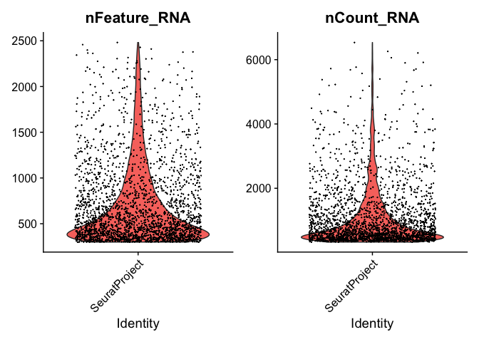<!-- -->

``` r
FeatureScatter(seurat_object_filtered, feature1 = "nCount_RNA", feature2 = "nFeature_RNA")
```

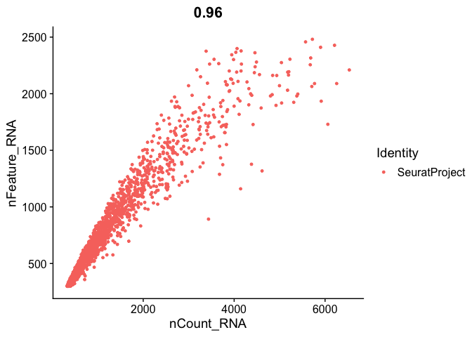<!-- -->

``` r
seurat_object_filtered_normalized <- NormalizeData(seurat_object_filtered)
```

    ## Normalizing layer: counts

``` r
seurat_object_filtered_normalized
```

    ## An object of class Seurat 
    ## 24947 features across 2399 samples within 1 assay 
    ## Active assay: RNA (24947 features, 0 variable features)
    ##  2 layers present: counts, data

Identify variable genes

``` r
seurat_object_filtered_normalized_selected <- FindVariableFeatures(seurat_object_filtered_normalized, selection.method = "vst", nfeatures = 2000)
```

    ## Finding variable features for layer counts

``` r
top10 <- head(VariableFeatures(seurat_object_filtered_normalized_selected), 10)

# plot variable features with and without labels
plot1 <- VariableFeaturePlot(seurat_object_filtered_normalized_selected)
plot2 <- LabelPoints(plot = plot1, points = top10, repel = TRUE)
```

    ## When using repel, set xnudge and ynudge to 0 for optimal results

``` r
plot2
```

    ## Warning in scale_x_log10(): log-10 transformation introduced infinite values.

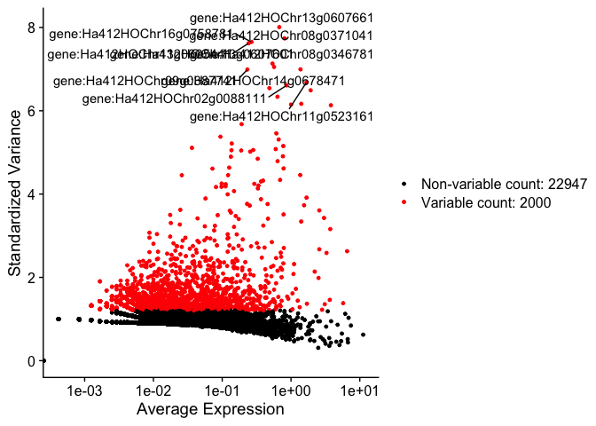<!-- -->
Now we process data for PCA and identify informative \# of PCs

``` r
all.genes <- rownames(seurat_object_filtered_normalized_selected)

seurat_object_filtered_normalized_selected_scaled <- ScaleData(seurat_object_filtered_normalized_selected, features = all.genes)
```

    ## Centering and scaling data matrix

``` r
seurat_object_filtered_normalized_selected_scaled_PCA <- RunPCA(seurat_object_filtered_normalized_selected_scaled, features = VariableFeatures(object = seurat_object_filtered_normalized_selected_scaled))
```

    ## PC_ 1 
    ## Positive:  gene:Ha412HOChr12g0568271, gene:Ha412HOChr09g0429331, gene:Ha412HOChr01g0010391, gene:Ha412HOChr16g0758921, gene:Ha412HOChr01g0032811, gene:Ha412HOChr01g0001441, gene:Ha412HOChr10g0445761, gene:Ha412HOChr17g0825561, gene:Ha412HOChr02g0086641, gene:Ha412HOChr14g0650411 
    ##     gene:Ha412HOChr10g0430461, gene:Ha412HOChr15g0711461, gene:Ha412HOChr01g0004741, gene:Ha412HOChr17g0839961, gene:Ha412HOChr01g0010411, gene:Ha412HOChr08g0330521, gene:Ha412HOChr14g0693001, gene:Ha412HOChr15g0727091, gene:Ha412HOChr04g0159091, gene:Ha412HOChr09g0428501 
    ##     gene:Ha412HOChr13g0598851, gene:Ha412HOChr07g0324951, gene:Ha412HOChr01g0036171, gene:Ha412HOChr04g0154201, gene:Ha412HOChr14g0681011, gene:Ha412HOChr14g0663311, gene:Ha412HOChr12g0537741, gene:Ha412HOChr16g0754201, gene:Ha412HOChr08g0345251, gene:Ha412HOChr12g0550721 
    ## Negative:  gene:Ha412HOChr13g0607601, gene:Ha412HOChr13g0607661, gene:Ha412HOChr08g0347431, gene:Ha412HOChr02g0088111, gene:Ha412HOChr08g0371041, gene:Ha412HOChr13g0605471, gene:Ha412HOChr07g0312571, gene:Ha412HOChr07g0313991, gene:Ha412HOChr14g0678471, gene:Ha412HOChr08g0346781 
    ##     gene:Ha412HOChr08g0354411, gene:Ha412HOChr11g0523161, gene:Ha412HOChr12g0556391, gene:Ha412HOChr01g0032671, gene:Ha412HOChr09g0387741, gene:Ha412HOChr06g0263081, gene:Ha412HOChr06g0262771, gene:Ha412HOChr13g0605511, gene:Ha412HOChr05g0227161, gene:Ha412HOChr09g0390301 
    ##     gene:Ha412HOChr09g0390291, gene:Ha412HOChr05g0227141, gene:Ha412HOChr12g0556411, gene:Ha412HOChr06g0275901, gene:Ha412HOChr16g0793331, gene:Ha412HOChr09g0416171, gene:Ha412HOChr11g0503601, gene:Ha412HOChr07g0312601, gene:Ha412HOChr08g0355161, gene:Ha412HOChr08g0354441 
    ## PC_ 2 
    ## Positive:  gene:Ha412HOChr11g0523161, gene:Ha412HOChr06g0263081, gene:Ha412HOChr14g0678471, gene:Ha412HOChr09g0390291, gene:Ha412HOChr14g0663311, gene:Ha412HOChr13g0605471, gene:Ha412HOChr08g0346781, gene:Ha412HOChr12g0556391, gene:Ha412HOChr13g0605511, gene:Ha412HOChr17g0838381 
    ##     gene:Ha412HOChr05g0223801, gene:Ha412HOChr07g0312601, gene:Ha412HOChr14g0667811, gene:Ha412HOChr01g0032671, gene:Ha412HOChr08g0371041, gene:Ha412HOChr08g0370741, gene:Ha412HOChr08g0347431, gene:Ha412HOChr09g0427821, gene:Ha412HOChr01g0015891, gene:Ha412HOChr07g0312571 
    ##     gene:Ha412HOChr02g0088111, gene:Ha412HOChr16g0747451, gene:Ha412HOChr14g0649091, gene:Ha412HOChr15g0707021, gene:Ha412HOChr13g0607661, gene:Ha412HOChr05g0227141, gene:Ha412HOChr12g0550451, gene:Ha412HOChr11g0506151, gene:Ha412HOChr10g0472071, gene:Ha412HOChr02g0067791 
    ## Negative:  gene:Ha412HOChr12g0535821, gene:Ha412HOChr13g0625111, gene:Ha412HOChr10g0463891, gene:Ha412HOChr12g0580731, gene:Ha412HOChr13g0625191, gene:Ha412HOChr16g0788371, gene:Ha412HOChr02g0091621, gene:Ha412HOChr03g0141851, gene:Ha412HOChr03g0141801, gene:Ha412HOChr01g0045141 
    ##     gene:Ha412HOChr10g0478571, gene:Ha412HOChr13g0598601, gene:Ha412HOChr05g0208121, gene:Ha412HOChr03g0135141, gene:Ha412HOChr16g0758861, gene:Ha412HOChr13g0625121, gene:Ha412HOChr03g0143411, gene:Ha412HOChr13g0625151, gene:Ha412HOChr09g0428601, gene:Ha412HOChr12g0565541 
    ##     gene:Ha412HOChr01g0045171, gene:Ha412HOChr03g0141771, gene:Ha412HOChr11g0479581, gene:Ha412HOChr15g0716271, gene:Ha412HOChr16g0758781, gene:Ha412HOChr01g0000681, gene:Ha412HOChr14g0692381, gene:Ha412HOChr05g0243591, gene:Ha412HOChr11g0487561, gene:Ha412HOChr05g0212781 
    ## PC_ 3 
    ## Positive:  gene:Ha412HOChr16g0758921, gene:Ha412HOChr16g0758861, gene:Ha412HOChr13g0625111, gene:Ha412HOChr13g0625191, gene:Ha412HOChr13g0625121, gene:Ha412HOChr03g0141801, gene:Ha412HOChr12g0535821, gene:Ha412HOChr10g0463891, gene:Ha412HOChr03g0141771, gene:Ha412HOChr09g0404811 
    ##     gene:Ha412HOChr03g0142111, gene:Ha412HOChr02g0091621, gene:Ha412HOChr10g0478571, gene:Ha412HOChr13g0582611, gene:Ha412HOChr12g0568271, gene:Ha412HOChr12g0556391, gene:Ha412HOChr03g0135141, gene:Ha412HOChr13g0625151, gene:Ha412HOChr15g0716271, gene:Ha412HOChr05g0243591 
    ##     gene:Ha412HOChr01g0010411, gene:Ha412HOChr12g0539161, gene:Ha412HOChr01g0045171, gene:Ha412HOChr14g0682481, gene:Ha412HOChr09g0429331, gene:Ha412HOChr12g0580731, gene:Ha412HOChr05g0230041, gene:Ha412HOChr02g0050281, gene:Ha412HOChr01g0032811, gene:Ha412HOChr01g0045141 
    ## Negative:  gene:Ha412HOChr01g0016501, gene:Ha412HOChr01g0016431, gene:Ha412HOChr12g0559061, gene:Ha412HOChr09g0372421, gene:Ha412HOChr05g0212781, gene:Ha412HOChr04g0184181, gene:Ha412HOChr11g0513501, gene:Ha412HOChr05g0240781, gene:Ha412HOChr08g0361801, gene:Ha412HOChr16g0748711 
    ##     gene:Ha412HOChr12g0559051, gene:Ha412HOChr16g0784741, gene:Ha412HOChr09g0428161, gene:Ha412HOChr04g0195481, gene:Ha412HOChr08g0362561, gene:Ha412HOChr16g0787591, gene:Ha412HOChr04g0183971, gene:Ha412HOChr09g0424311, gene:Ha412HOChr04g0171981, gene:Ha412HOChr07g0323011 
    ##     gene:Ha412HOChr06g0272761, gene:Ha412HOChr11g0491361, gene:Ha412HOChr17g0836601, gene:Ha412HOChr17g0814191, gene:Ha412HOChr11g0491391, gene:Ha412HOChr17g0833761, gene:Ha412HOChr10g0445761, gene:Ha412HOChr12g0580761, gene:Ha412HOChr11g0491371, gene:Ha412HOChr04g0196721 
    ## PC_ 4 
    ## Positive:  gene:Ha412HOChr10g0463891, gene:Ha412HOChr02g0062911, gene:Ha412HOChr15g0700221, gene:Ha412HOChr03g0143411, gene:Ha412HOChr10g0468801, gene:Ha412HOChr09g0428601, gene:Ha412HOChr17g0843931, gene:Ha412HOChr08g0351211, gene:Ha412HOChr14g0655591, gene:Ha412HOChr11g0492431 
    ##     gene:Ha412HOChr16g0778941, gene:Ha412HOChr02g0091621, gene:Ha412HOChr11g0481401, gene:Ha412HOChr17g0818271, gene:Ha412HOChr12g0535821, gene:Ha412HOChr12g0533601, gene:Ha412HOChr14g0692011, gene:Ha412HOChr12g0576331, gene:Ha412HOChr08g0370741, gene:Ha412HOChr04g0184031 
    ##     gene:Ha412HOChr16g0782111, gene:Ha412HOChr03g0132481, gene:Ha412HOChr16g0799921, gene:Ha412HOChr15g0716271, gene:Ha412HOChr15g0739261, gene:Ha412HOChr05g0230041, gene:Ha412HOChr05g0208121, gene:Ha412HOChr04g0195531, gene:Ha412HOChr15g0718101, gene:Ha412HOChr10g0431011 
    ## Negative:  gene:Ha412HOChr11g0482691, gene:Ha412HOChr04g0154201, gene:Ha412HOChr01g0004661, gene:Ha412HOChr01g0004741, gene:Ha412HOChr12g0568271, gene:Ha412HOChr08g0332601, gene:Ha412HOChr10g0464861, gene:Ha412HOChr08g0345251, gene:Ha412HOChr03g0139221, gene:Ha412HOChr13g0630951 
    ##     gene:Ha412HOChr10g0435781, gene:Ha412HOChr09g0429331, gene:Ha412HOChr01g0032811, gene:Ha412HOChr14g0658511, gene:Ha412HOChr01g0018251, gene:Ha412HOChr13g0615921, gene:Ha412HOChr10g0445761, gene:Ha412HOChr01g0010391, gene:Ha412HOChr01g0036171, gene:Ha412HOChr17g0853891 
    ##     gene:Ha412HOChr01g0001441, gene:Ha412HOChr17g0833761, gene:Ha412HOChr08g0330521, gene:Ha412HOChr07g0317631, gene:Ha412HOChr10g0430461, gene:Ha412HOChr06g0274031, gene:Ha412HOChr13g0582771, gene:Ha412HOChr01g0036181, gene:Ha412HOChr08g0341311, gene:Ha412HOChr13g0582811 
    ## PC_ 5 
    ## Positive:  gene:Ha412HOChr17g0844771, gene:Ha412HOChr13g0632191, gene:Ha412HOChr09g0373391, gene:Ha412HOChr09g0373431, gene:Ha412HOChr09g0373491, gene:Ha412HOChr07g0325611, gene:Ha412HOChr12g0577061, gene:Ha412HOChr03g0137671, gene:Ha412HOChr05g0210631, gene:Ha412HOChr07g0299911 
    ##     gene:Ha412HOChr10g0451991, gene:Ha412HOChr04g0198371, gene:Ha412HOChr17g0819171, gene:Ha412HOChr13g0629321, gene:Ha412HOChr06g0246861, gene:Ha412HOChr13g0610261, gene:Ha412HOChr03g0100361, gene:Ha412HOChr13g0629001, gene:Ha412HOChr15g0694271, gene:Ha412HOChr09g0423241 
    ##     gene:Ha412HOChr11g0496671, gene:Ha412HOChr06g0254101, gene:Ha412HOChr09g0395411, gene:Ha412HOChr10g0451951, gene:Ha412HOChr07g0308661, gene:Ha412HOChr17g0823691, gene:Ha412HOChr03g0131921, gene:Ha412HOChr15g0726661, gene:Ha412HOChr15g0695501, gene:Ha412HOChr11g0482591 
    ## Negative:  gene:Ha412HOChr03g0141851, gene:Ha412HOChr12g0535821, gene:Ha412HOChr03g0135141, gene:Ha412HOChr01g0028091, gene:Ha412HOChr10g0463891, gene:Ha412HOChr01g0004661, gene:Ha412HOChr01g0045141, gene:Ha412HOChr13g0598601, gene:Ha412HOChr01g0045171, gene:Ha412HOChr04g0154201 
    ##     gene:Ha412HOChr01g0018251, gene:Ha412HOChr02g0091621, gene:Ha412HOChr16g0788371, gene:Ha412HOChr11g0487561, gene:Ha412HOChr05g0208121, gene:Ha412HOChr10g0445761, gene:Ha412HOChr12g0539161, gene:Ha412HOChr14g0651661, gene:Ha412HOChr11g0488841, gene:Ha412HOChr09g0372421 
    ##     gene:Ha412HOChr15g0716271, gene:Ha412HOChr07g0289811, gene:Ha412HOChr05g0243591, gene:Ha412HOChr12g0565541, gene:Ha412HOChr04g0171981, gene:Ha412HOChr10g0467191, gene:Ha412HOChr03g0143411, gene:Ha412HOChr11g0479581, gene:Ha412HOChr14g0682481, gene:Ha412HOChr01g0001131

``` r
print(seurat_object_filtered_normalized_selected_scaled_PCA[["pca"]], dims = 1:5, nfeatures = 5)
```

    ## PC_ 1 
    ## Positive:  gene:Ha412HOChr12g0568271, gene:Ha412HOChr09g0429331, gene:Ha412HOChr01g0010391, gene:Ha412HOChr16g0758921, gene:Ha412HOChr01g0032811 
    ## Negative:  gene:Ha412HOChr13g0607601, gene:Ha412HOChr13g0607661, gene:Ha412HOChr08g0347431, gene:Ha412HOChr02g0088111, gene:Ha412HOChr08g0371041 
    ## PC_ 2 
    ## Positive:  gene:Ha412HOChr11g0523161, gene:Ha412HOChr06g0263081, gene:Ha412HOChr14g0678471, gene:Ha412HOChr09g0390291, gene:Ha412HOChr14g0663311 
    ## Negative:  gene:Ha412HOChr12g0535821, gene:Ha412HOChr13g0625111, gene:Ha412HOChr10g0463891, gene:Ha412HOChr12g0580731, gene:Ha412HOChr13g0625191 
    ## PC_ 3 
    ## Positive:  gene:Ha412HOChr16g0758921, gene:Ha412HOChr16g0758861, gene:Ha412HOChr13g0625111, gene:Ha412HOChr13g0625191, gene:Ha412HOChr13g0625121 
    ## Negative:  gene:Ha412HOChr01g0016501, gene:Ha412HOChr01g0016431, gene:Ha412HOChr12g0559061, gene:Ha412HOChr09g0372421, gene:Ha412HOChr05g0212781 
    ## PC_ 4 
    ## Positive:  gene:Ha412HOChr10g0463891, gene:Ha412HOChr02g0062911, gene:Ha412HOChr15g0700221, gene:Ha412HOChr03g0143411, gene:Ha412HOChr10g0468801 
    ## Negative:  gene:Ha412HOChr11g0482691, gene:Ha412HOChr04g0154201, gene:Ha412HOChr01g0004661, gene:Ha412HOChr01g0004741, gene:Ha412HOChr12g0568271 
    ## PC_ 5 
    ## Positive:  gene:Ha412HOChr17g0844771, gene:Ha412HOChr13g0632191, gene:Ha412HOChr09g0373391, gene:Ha412HOChr09g0373431, gene:Ha412HOChr09g0373491 
    ## Negative:  gene:Ha412HOChr03g0141851, gene:Ha412HOChr12g0535821, gene:Ha412HOChr03g0135141, gene:Ha412HOChr01g0028091, gene:Ha412HOChr10g0463891

``` r
VizDimLoadings(seurat_object_filtered_normalized_selected_scaled_PCA, dims = 1:2, reduction = "pca")
```

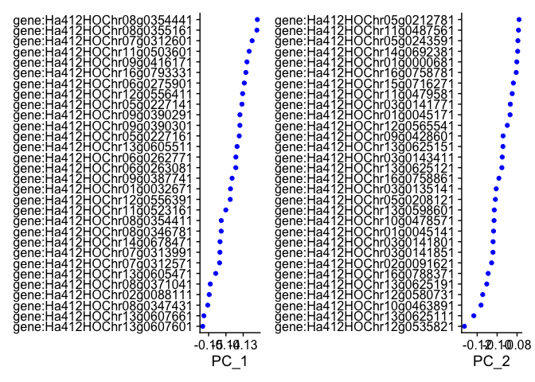<!-- -->

``` r
DimPlot(seurat_object_filtered_normalized_selected_scaled_PCA, reduction = "pca") + NoLegend()
```

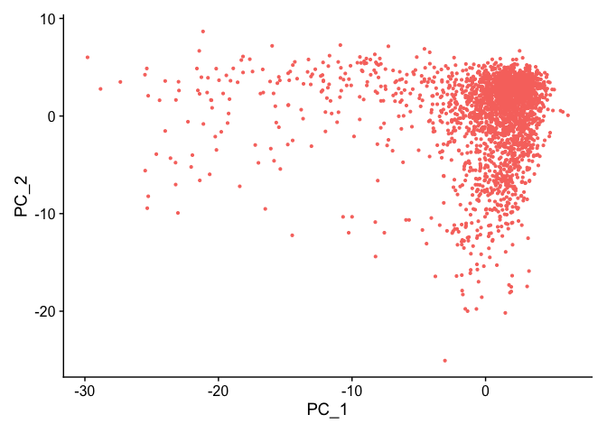<!-- -->

``` r
DimHeatmap(seurat_object_filtered_normalized_selected_scaled_PCA, dims = 1:15, cells = 500, balanced = TRUE)
```

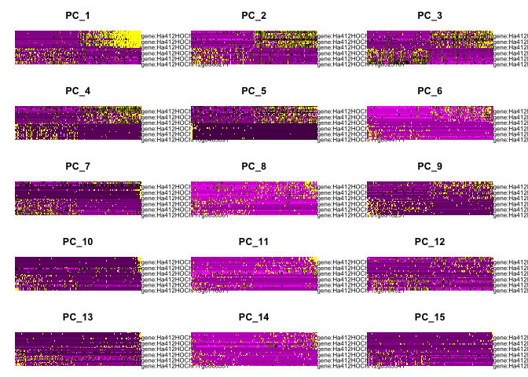<!-- -->

``` r
ElbowPlot(seurat_object_filtered_normalized_selected_scaled_PCA)
```

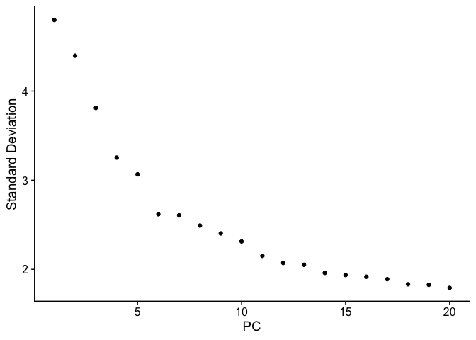<!-- -->
Looks like 6 for a cutoff? Now we try to cluster by cell types

``` r
seurat_object_filtered_normalized_selected_scaled_PCA_cellcluster <- FindNeighbors(seurat_object_filtered_normalized_selected_scaled_PCA, dims = 1:6)
```

    ## Computing nearest neighbor graph

    ## Warning: package 'future' was built under R version 4.4.1

    ## Computing SNN

``` r
seurat_object_filtered_normalized_selected_scaled_PCA_cellcluster <- FindClusters(seurat_object_filtered_normalized_selected_scaled_PCA_cellcluster, resolution = 0.5)
```

    ## Modularity Optimizer version 1.3.0 by Ludo Waltman and Nees Jan van Eck
    ## 
    ## Number of nodes: 2399
    ## Number of edges: 72891
    ## 
    ## Running Louvain algorithm...
    ## Maximum modularity in 10 random starts: 0.8272
    ## Number of communities: 7
    ## Elapsed time: 0 seconds

``` r
seurat_object_filtered_normalized_selected_scaled_PCA_cellcluster <- RunUMAP(seurat_object_filtered_normalized_selected_scaled_PCA_cellcluster, dims = 1:6)
```

    ## Warning: The default method for RunUMAP has changed from calling Python UMAP via reticulate to the R-native UWOT using the cosine metric
    ## To use Python UMAP via reticulate, set umap.method to 'umap-learn' and metric to 'correlation'
    ## This message will be shown once per session

    ## 15:24:42 UMAP embedding parameters a = 0.9922 b = 1.112

    ## 15:24:42 Read 2399 rows and found 6 numeric columns

    ## 15:24:42 Using Annoy for neighbor search, n_neighbors = 30

    ## 15:24:42 Building Annoy index with metric = cosine, n_trees = 50

    ## 0%   10   20   30   40   50   60   70   80   90   100%

    ## [----|----|----|----|----|----|----|----|----|----|

    ## **************************************************|
    ## 15:24:42 Writing NN index file to temp file /var/folders/76/gx72vzt52xx0tlcdnpkwb1pw0000gn/T//RtmpoSVJdU/file6b471136cd6d
    ## 15:24:42 Searching Annoy index using 1 thread, search_k = 3000
    ## 15:24:42 Annoy recall = 100%
    ## 15:24:43 Commencing smooth kNN distance calibration using 1 thread with target n_neighbors = 30
    ## 15:24:43 Initializing from normalized Laplacian + noise (using RSpectra)
    ## 15:24:43 Commencing optimization for 500 epochs, with 91780 positive edges
    ## 15:24:43 Using rng type: pcg
    ## 15:24:44 Optimization finished

``` r
DimPlot(seurat_object_filtered_normalized_selected_scaled_PCA_cellcluster, reduction = "umap")
```

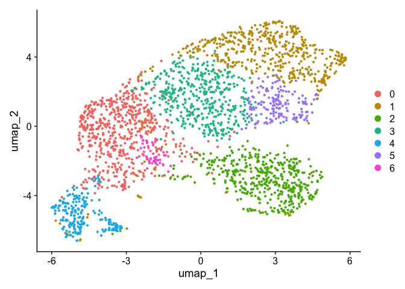<!-- -->
Now let’s see if our genes of interested are expressed in any clusters.
We will also find, for each cluster, every gene that is significantly
differently expressed from other clusters.

“gene:Ha412HOChr10g0435441”, “gene:Ha412HOChr10g0435451”,
“gene:Ha412HOChr10g0435491”, “gene:Ha412HOChr10g0435511”

Ha412HOChr10g0435621 wasn’t found

``` r
FeaturePlot(seurat_object_filtered_normalized_selected_scaled_PCA_cellcluster, features = c("gene:Ha412HOChr10g0435441", "gene:Ha412HOChr10g0435451", "gene:Ha412HOChr10g0435491", "gene:Ha412HOChr10g0435511"))
```

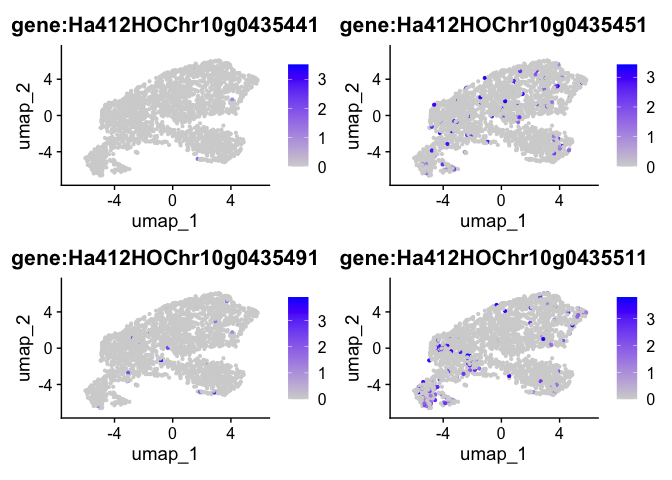<!-- -->

``` r
VlnPlot(seurat_object_filtered_normalized_selected_scaled_PCA_cellcluster, features = c("gene:Ha412HOChr10g0435441", "gene:Ha412HOChr10g0435451", "gene:Ha412HOChr10g0435491", "gene:Ha412HOChr10g0435511"))
```

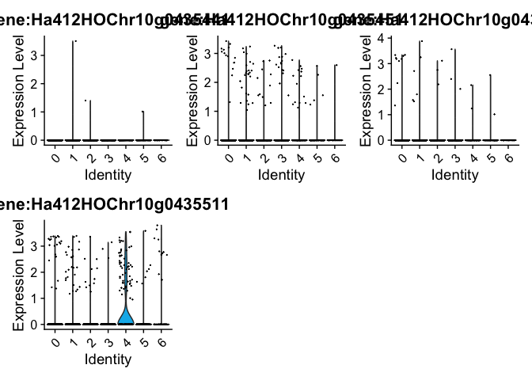<!-- -->

``` r
seurat.markers <- FindAllMarkers(seurat_object_filtered_normalized_selected_scaled_PCA_cellcluster, only.pos = TRUE)
```

    ## Calculating cluster 0

    ## Warning: The `slot` argument of `GetAssayData()` is deprecated as of SeuratObject 5.0.0.
    ## ℹ Please use the `layer` argument instead.
    ## ℹ The deprecated feature was likely used in the Seurat package.
    ##   Please report the issue at <https://github.com/satijalab/seurat/issues>.
    ## This warning is displayed once every 8 hours.
    ## Call `lifecycle::last_lifecycle_warnings()` to see where this warning was
    ## generated.

    ## For a (much!) faster implementation of the Wilcoxon Rank Sum Test,
    ## (default method for FindMarkers) please install the presto package
    ## --------------------------------------------
    ## install.packages('devtools')
    ## devtools::install_github('immunogenomics/presto')
    ## --------------------------------------------
    ## After installation of presto, Seurat will automatically use the more 
    ## efficient implementation (no further action necessary).
    ## This message will be shown once per session

    ## Calculating cluster 1

    ## Calculating cluster 2

    ## Calculating cluster 3

    ## Calculating cluster 4

    ## Calculating cluster 5

    ## Calculating cluster 6

``` r
seurat.markers %>%
  group_by(cluster) %>%
  dplyr::filter(avg_log2FC > 1)
```

    ## # A tibble: 5,572 × 7
    ## # Groups:   cluster [7]
    ##       p_val avg_log2FC pct.1 pct.2 p_val_adj cluster gene                     
    ##       <dbl>      <dbl> <dbl> <dbl>     <dbl> <fct>   <chr>                    
    ##  1 2.20e-78       1.46 0.821 0.526  5.48e-74 0       gene:Ha412HOChr14g0635561
    ##  2 2.62e-49       2.05 0.438 0.167  6.53e-45 0       gene:Ha412HOChr09g0397821
    ##  3 1.92e-48       3.34 0.248 0.048  4.80e-44 0       gene:Ha412HOChr05g0223801
    ##  4 2.13e-37       1.42 0.619 0.449  5.32e-33 0       gene:Ha412HOChr13g0611131
    ##  5 3.61e-37       3.62 0.156 0.021  9.00e-33 0       gene:Ha412HOChr14g0649091
    ##  6 1.85e-35       1.90 0.495 0.293  4.62e-31 0       gene:Ha412HOChr17g0838381
    ##  7 5.06e-33       2.95 0.167 0.029  1.26e-28 0       gene:Ha412HOChr01g0015891
    ##  8 8.38e-26       2.38 0.223 0.073  2.09e-21 0       gene:Ha412HOChr04g0189201
    ##  9 3.90e-25       2.06 0.227 0.076  9.72e-21 0       gene:Ha412HOChr02g0068601
    ## 10 1.34e-24       1.81 0.312 0.14   3.35e-20 0       gene:Ha412HOChr12g0579231
    ## # ℹ 5,562 more rows

``` r
seurat.markers %>%
  group_by(cluster) %>%
  dplyr::filter(avg_log2FC > 1) %>%
  slice_head(n = 10) %>%
  ungroup() -> top10

DoHeatmap(seurat_object_filtered_normalized_selected_scaled_PCA_cellcluster, features = top10$gene)
```

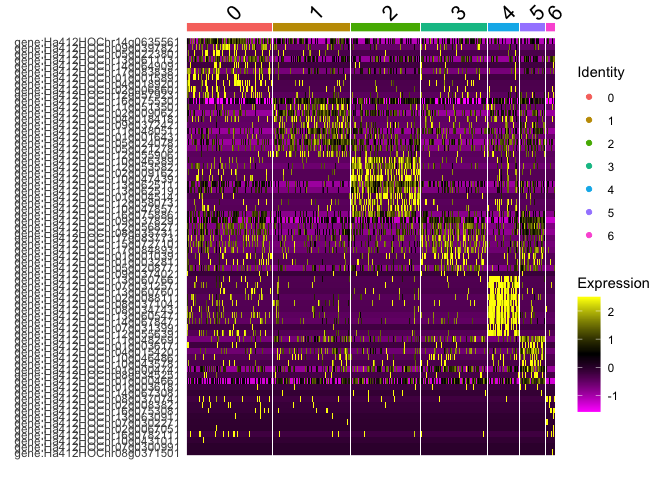<!-- -->
Looks like something is going in with gene:Ha412HOChr10g0435511 in
cluster 4, and cluster 4 more generally

## XRQ

Rinse and repeat

``` r
data_dir_XRQ <- 'XRQ_Dragen'
list.files(data_dir) # Should show barcodes.tsv, genes.tsv, and matrix.mtx
```

    ## [1] "barcodes.tsv.gz" "features.tsv.gz" "matrix.mtx.gz"

``` r
expression_matrix_XRQ <- Read10X(data.dir = data_dir_XRQ)
seurat_object_XRQ = CreateSeuratObject(counts = expression_matrix_XRQ, min.features = 300, min.cells = 3)

seurat_object_XRQ
```

    ## An object of class Seurat 
    ## 29396 features across 19062 samples within 1 assay 
    ## Active assay: RNA (29396 features, 0 variable features)
    ##  1 layer present: counts

Way more cells (19,062)!!!

``` r
VlnPlot(seurat_object_XRQ, features = c("nFeature_RNA", "nCount_RNA"), ncol = 2)
```

    ## Warning: Default search for "data" layer in "RNA" assay yielded no results;
    ## utilizing "counts" layer instead.

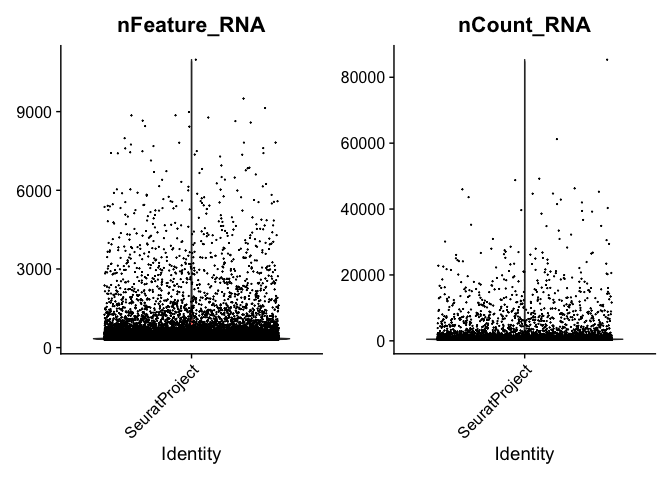<!-- -->

``` r
FeatureScatter(seurat_object_XRQ, feature1 = "nCount_RNA", feature2 = "nFeature_RNA")
```

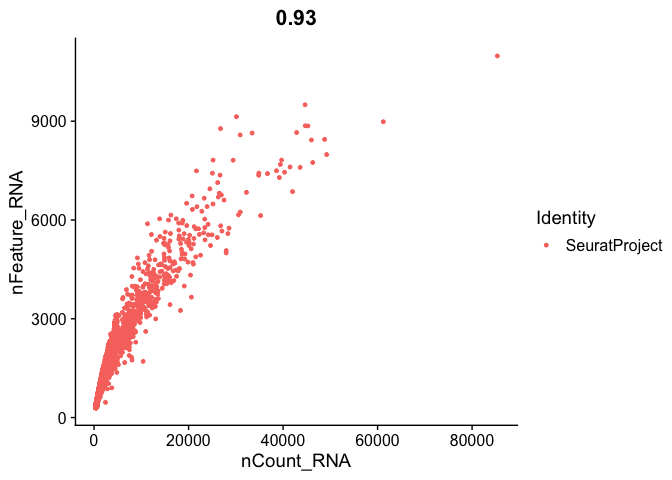<!-- -->

``` r
#hist of nCount_RNA

ggplot(seurat_object_XRQ@meta.data, aes(x = nCount_RNA)) + xlim(0, 5000) +
  geom_histogram(bins = 100, fill = "lightgreen", color = "black") +
  geom_vline(aes(xintercept = 1000), colour="black") +
  labs(title = "XRQ Total Number of Counts (nCount_RNA)", x = "nCount_RNA", y = "Number of Cells")
```

    ## Warning: Removed 497 rows containing non-finite outside the scale range
    ## (`stat_bin()`).

    ## Warning: Removed 2 rows containing missing values or values outside the scale range
    ## (`geom_bar()`).

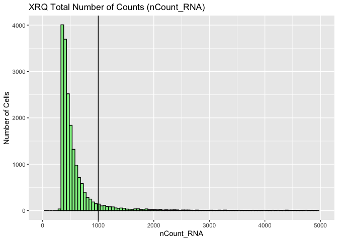<!-- -->

``` r
#hist of nFeature_RNA

ggplot(seurat_object_XRQ@meta.data, aes(x = nFeature_RNA)) + 
  geom_histogram(bins = 100, fill = "red", color = "black") +
  geom_vline(aes(xintercept = 1000), colour="black") +
  labs(title = "XRQ Total Number of Counts (nFeature_RNA)", x = "nFeature_RNA", y = "Number of Cells")
```

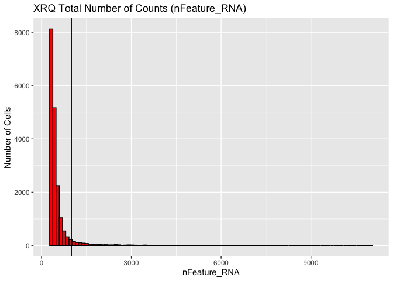<!-- -->

``` r
seurat_object_XRQ_filtered <- subset(seurat_object_XRQ, subset = nFeature_RNA > 145 & nFeature_RNA < 1000 & nCount_RNA > 160 & nCount_RNA < 1000)

seurat_object_XRQ_filtered
```

    ## An object of class Seurat 
    ## 29396 features across 17001 samples within 1 assay 
    ## Active assay: RNA (29396 features, 0 variable features)
    ##  1 layer present: counts

``` r
VlnPlot(seurat_object_XRQ_filtered, features = c("nFeature_RNA", "nCount_RNA"), ncol = 2)
```

    ## Warning: Default search for "data" layer in "RNA" assay yielded no results;
    ## utilizing "counts" layer instead.

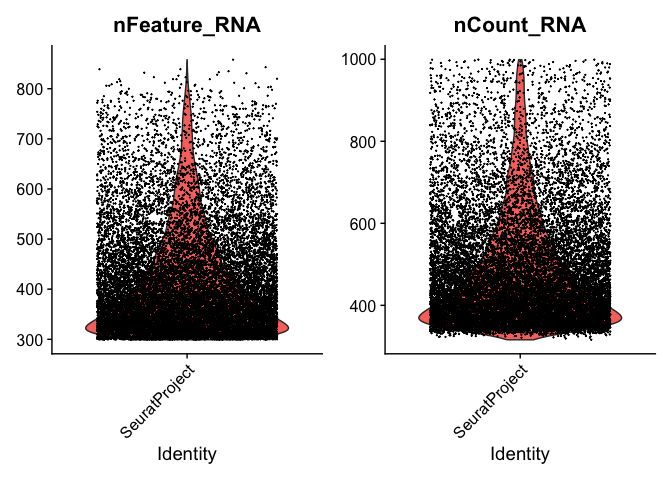<!-- -->

``` r
FeatureScatter(seurat_object_XRQ_filtered, feature1 = "nCount_RNA", feature2 = "nFeature_RNA")
```

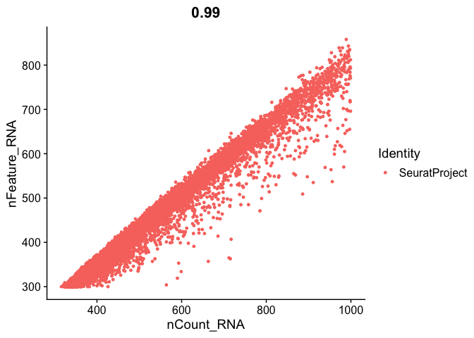<!-- -->

``` r
seurat_object_XRQ_filtered_normalized <- NormalizeData(seurat_object_XRQ_filtered)
```

    ## Normalizing layer: counts

``` r
#Feature selection

seurat_object_XRQ_filtered_normalized_selected <- FindVariableFeatures(seurat_object_XRQ_filtered_normalized, selection.method = "vst", nfeatures = 2000)
```

    ## Finding variable features for layer counts

``` r
# Identify the 10 most highly variable genes
top10 <- head(VariableFeatures(seurat_object_XRQ_filtered_normalized_selected), 10)

# plot variable features with and without labels
plot1 <- VariableFeaturePlot(seurat_object_XRQ_filtered_normalized_selected)
plot2 <- LabelPoints(plot = plot1, points = top10, repel = TRUE)
```

    ## When using repel, set xnudge and ynudge to 0 for optimal results

``` r
plot2
```

    ## Warning in scale_x_log10(): log-10 transformation introduced infinite values.

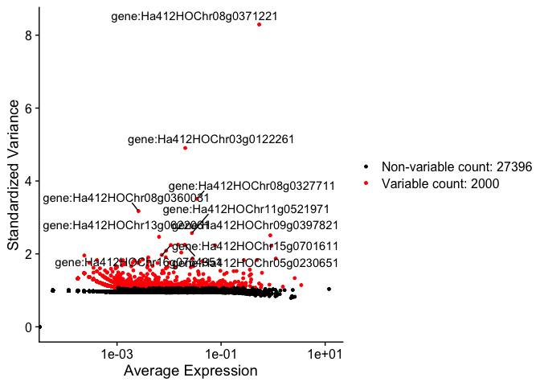<!-- -->
PCA and Elbow plot

``` r
all.genes_XRQ <- rownames(seurat_object_XRQ_filtered_normalized_selected)

seurat_object_XRQ_filtered_normalized_selected_scaled <- ScaleData(seurat_object_XRQ_filtered_normalized_selected, features = all.genes_XRQ)
```

    ## Centering and scaling data matrix

``` r
seurat_object_XRQ_filtered_normalized_selected_scaled_PCA <- RunPCA(seurat_object_XRQ_filtered_normalized_selected_scaled, features = VariableFeatures(object = seurat_object_XRQ_filtered_normalized_selected_scaled))
```

    ## PC_ 1 
    ## Positive:  gene:Ha412HOChr11g0506151, gene:Ha412HOChr11g0525941, gene:Ha412HOChr15g0701611, gene:Ha412HOChr09g0380061, gene:Ha412HOChr14g0668971, gene:Ha412HOChr05g0211431, gene:Ha412HOChr13g0601641, gene:Ha412HOChr15g0703091, gene:Ha412HOChr17g0838381, gene:Ha412HOChr17g0850211 
    ##     gene:Ha412HOChr07g0316631, gene:Ha412HOChr08g0333961, gene:Ha412HOChr10g0438901, gene:Ha412HOChr12g0579231, gene:Ha412HOChr08g0333511, gene:Ha412HOChr11g0491701, gene:Ha412HOChr00c00944g0865351, gene:Ha412HOChr17g0839961, gene:Ha412HOChr10g0442061, gene:Ha412HOChr07g0298011 
    ##     gene:Ha412HOChr14g0692451, gene:Ha412HOChr01g0008021, gene:Ha412HOChr12g0539571, gene:Ha412HOChr17g0853601, gene:Ha412HOChr06g0272681, gene:Ha412HOChr09g0388561, gene:Ha412HOChr10g0474901, gene:Ha412HOChr02g0076521, gene:Ha412HOChr14g0666221, gene:Ha412HOChr14g0652741 
    ## Negative:  gene:Ha412HOChr16g0755301, gene:Ha412HOChr01g0041481, gene:Ha412HOChr13g0605511, gene:Ha412HOChr01g0018251, gene:Ha412HOChr08g0354411, gene:Ha412HOChr14g0678471, gene:Ha412HOChr15g0716671, gene:Ha412HOChr01g0036181, gene:Ha412HOChr04g0171981, gene:Ha412HOChr01g0004661 
    ##     gene:Ha412HOChr16g0787591, gene:Ha412HOChr01g0036171, gene:Ha412HOChr03g0135141, gene:Ha412HOChr14g0637471, gene:Ha412HOChr08g0339131, gene:Ha412HOChr06g0263081, gene:Ha412HOChr11g0480511, gene:Ha412HOChr14g0637721, gene:Ha412HOChr06g0254441, gene:Ha412HOChr08g0347431 
    ##     gene:Ha412HOChr05g0204881, gene:Ha412HOChr01g0028091, gene:Ha412HOChr02g0088111, gene:Ha412HOChr07g0312591, gene:Ha412HOChr07g0320211, gene:Ha412HOChr13g0630951, gene:Ha412HOChr12g0574121, gene:Ha412HOChr07g0309041, gene:Ha412HOChr13g0603221, gene:Ha412HOChr05g0210211 
    ## PC_ 2 
    ## Positive:  gene:Ha412HOChr15g0701611, gene:Ha412HOChr11g0525941, gene:Ha412HOChr07g0316631, gene:Ha412HOChr11g0521971, gene:Ha412HOChr17g0850211, gene:Ha412HOChr08g0333961, gene:Ha412HOChr10g0442061, gene:Ha412HOChr07g0298011, gene:Ha412HOChr06g0254121, gene:Ha412HOChr13g0630911 
    ##     gene:Ha412HOChr17g0853601, gene:Ha412HOChr10g0431011, gene:Ha412HOChr09g0395781, gene:Ha412HOChr11g0517321, gene:Ha412HOChr04g0154531, gene:Ha412HOChr11g0482871, gene:Ha412HOChr14g0652741, gene:Ha412HOChr14g0676291, gene:Ha412HOChr13g0610071, gene:Ha412HOChr16g0782111 
    ##     gene:Ha412HOChr14g0666221, gene:Ha412HOChr07g0294631, gene:Ha412HOChr06g0279051, gene:Ha412HOChr11g0517401, gene:Ha412HOChr12g0565541, gene:Ha412HOChr06g0267111, gene:Ha412HOChr12g0553001, gene:Ha412HOChr08g0371221, gene:Ha412HOChr09g0399671, gene:Ha412HOChr05g0219641 
    ## Negative:  gene:Ha412HOChr11g0506151, gene:Ha412HOChr09g0380061, gene:Ha412HOChr13g0601641, gene:Ha412HOChr14g0692451, gene:Ha412HOChr12g0579231, gene:Ha412HOChr10g0438901, gene:Ha412HOChr15g0703091, gene:Ha412HOChr00c00944g0865351, gene:Ha412HOChr05g0211431, gene:Ha412HOChr08g0333511 
    ##     gene:Ha412HOChr11g0491701, gene:Ha412HOChr17g0839961, gene:Ha412HOChr17g0838381, gene:Ha412HOChr01g0008021, gene:Ha412HOChr06g0272681, gene:Ha412HOChr14g0668971, gene:Ha412HOChr14g0654081, gene:Ha412HOChr15g0698691, gene:Ha412HOChr01g0041481, gene:Ha412HOChr09g0388561 
    ##     gene:Ha412HOChr01g0001441, gene:Ha412HOChr05g0233291, gene:Ha412HOChr16g0761411, gene:Ha412HOChr04g0146451, gene:Ha412HOChr09g0416801, gene:Ha412HOChr07g0311471, gene:Ha412HOChr04g0198451, gene:Ha412HOChr04g0193711, gene:Ha412HOChr14g0662671, gene:Ha412HOChr09g0425671 
    ## PC_ 3 
    ## Positive:  gene:Ha412HOChr15g0701611, gene:Ha412HOChr11g0525941, gene:Ha412HOChr07g0316631, gene:Ha412HOChr17g0850211, gene:Ha412HOChr08g0333961, gene:Ha412HOChr07g0298011, gene:Ha412HOChr06g0254121, gene:Ha412HOChr17g0853601, gene:Ha412HOChr10g0442061, gene:Ha412HOChr14g0666221 
    ##     gene:Ha412HOChr16g0755301, gene:Ha412HOChr07g0294631, gene:Ha412HOChr13g0610071, gene:Ha412HOChr01g0041481, gene:Ha412HOChr02g0088031, gene:Ha412HOChr14g0652741, gene:Ha412HOChr16g0779711, gene:Ha412HOChr11g0484721, gene:Ha412HOChr14g0676291, gene:Ha412HOChr09g0418531 
    ##     gene:Ha412HOChr01g0012391, gene:Ha412HOChr07g0301851, gene:Ha412HOChr05g0219641, gene:Ha412HOChr05g0243221, gene:Ha412HOChr03g0124371, gene:Ha412HOChr01g0006821, gene:Ha412HOChr01g0004661, gene:Ha412HOChr01g0004701, gene:Ha412HOChr09g0424621, gene:Ha412HOChr13g0583141 
    ## Negative:  gene:Ha412HOChr11g0521971, gene:Ha412HOChr10g0431011, gene:Ha412HOChr11g0517321, gene:Ha412HOChr13g0630911, gene:Ha412HOChr16g0782111, gene:Ha412HOChr03g0097991, gene:Ha412HOChr06g0279051, gene:Ha412HOChr12g0553001, gene:Ha412HOChr11g0482871, gene:Ha412HOChr11g0517401 
    ##     gene:Ha412HOChr04g0154531, gene:Ha412HOChr09g0395781, gene:Ha412HOChr06g0263501, gene:Ha412HOChr10g0436451, gene:Ha412HOChr12g0565541, gene:Ha412HOChr04g0185721, gene:Ha412HOChr06g0263531, gene:Ha412HOChr01g0002421, gene:Ha412HOChr09g0392261, gene:Ha412HOChr10g0445411 
    ##     gene:Ha412HOChr09g0399671, gene:Ha412HOChr10g0464161, gene:Ha412HOChr06g0285241, gene:Ha412HOChr16g0776481, gene:Ha412HOChr09g0417601, gene:Ha412HOChr08g0365321, gene:Ha412HOChr02g0052701, gene:Ha412HOChr12g0550451, gene:Ha412HOChr16g0757601, gene:Ha412HOChr15g0731791 
    ## PC_ 4 
    ## Positive:  gene:Ha412HOChr11g0521971, gene:Ha412HOChr11g0517321, gene:Ha412HOChr13g0630911, gene:Ha412HOChr10g0431011, gene:Ha412HOChr06g0279051, gene:Ha412HOChr04g0154531, gene:Ha412HOChr12g0553001, gene:Ha412HOChr03g0097991, gene:Ha412HOChr11g0517401, gene:Ha412HOChr09g0395781 
    ##     gene:Ha412HOChr11g0482871, gene:Ha412HOChr10g0436451, gene:Ha412HOChr04g0185721, gene:Ha412HOChr09g0399671, gene:Ha412HOChr09g0392261, gene:Ha412HOChr06g0285241, gene:Ha412HOChr02g0052701, gene:Ha412HOChr15g0731791, gene:Ha412HOChr05g0244421, gene:Ha412HOChr01g0002421 
    ##     gene:Ha412HOChr05g0241811, gene:Ha412HOChr16g0782111, gene:Ha412HOChr10g0451031, gene:Ha412HOChr10g0465061, gene:Ha412HOChr11g0514501, gene:Ha412HOChr09g0396221, gene:Ha412HOChr11g0506151, gene:Ha412HOChr06g0260851, gene:Ha412HOChr13g0601641, gene:Ha412HOChr04g0194501 
    ## Negative:  gene:Ha412HOChr12g0565541, gene:Ha412HOChr06g0263531, gene:Ha412HOChr02g0082891, gene:Ha412HOChr08g0365321, gene:Ha412HOChr06g0263501, gene:Ha412HOChr05g0230971, gene:Ha412HOChr16g0757601, gene:Ha412HOChr16g0776481, gene:Ha412HOChr03g0101411, gene:Ha412HOChr15g0716671 
    ##     gene:Ha412HOChr04g0198951, gene:Ha412HOChr10g0436361, gene:Ha412HOChr09g0417601, gene:Ha412HOChr14g0678101, gene:Ha412HOChr06g0265101, gene:Ha412HOChr13g0625111, gene:Ha412HOChr04g0154201, gene:Ha412HOChr12g0562231, gene:Ha412HOChr05g0204621, gene:Ha412HOChr01g0000241 
    ##     gene:Ha412HOChr15g0694271, gene:Ha412HOChr13g0627721, gene:Ha412HOChr08g0371221, gene:Ha412HOChr10g0451951, gene:Ha412HOChr04g0180591, gene:Ha412HOChr16g0789661, gene:Ha412HOChr14g0637471, gene:Ha412HOChr15g0702301, gene:Ha412HOChr05g0230651, gene:Ha412HOChr06g0267111 
    ## PC_ 5 
    ## Positive:  gene:Ha412HOChr15g0716671, gene:Ha412HOChr12g0565541, gene:Ha412HOChr06g0263501, gene:Ha412HOChr06g0263531, gene:Ha412HOChr09g0417601, gene:Ha412HOChr16g0776481, gene:Ha412HOChr16g0757601, gene:Ha412HOChr10g0436361, gene:Ha412HOChr08g0365321, gene:Ha412HOChr04g0198951 
    ##     gene:Ha412HOChr12g0562231, gene:Ha412HOChr02g0082891, gene:Ha412HOChr01g0041481, gene:Ha412HOChr05g0230971, gene:Ha412HOChr06g0265101, gene:Ha412HOChr06g0254441, gene:Ha412HOChr14g0678101, gene:Ha412HOChr04g0154201, gene:Ha412HOChr11g0521971, gene:Ha412HOChr14g0637721 
    ##     gene:Ha412HOChr03g0101411, gene:Ha412HOChr05g0204621, gene:Ha412HOChr03g0137081, gene:Ha412HOChr16g0755301, gene:Ha412HOChr04g0154531, gene:Ha412HOChr04g0180591, gene:Ha412HOChr07g0323011, gene:Ha412HOChr09g0395781, gene:Ha412HOChr10g0431011, gene:Ha412HOChr12g0553001 
    ## Negative:  gene:Ha412HOChr15g0694271, gene:Ha412HOChr08g0371221, gene:Ha412HOChr10g0451951, gene:Ha412HOChr01g0008421, gene:Ha412HOChr15g0716771, gene:Ha412HOChr12g0550451, gene:Ha412HOChr15g0702301, gene:Ha412HOChr10g0458521, gene:Ha412HOChr10g0451991, gene:Ha412HOChr06g0261831 
    ##     gene:Ha412HOChr06g0267111, gene:Ha412HOChr08g0335001, gene:Ha412HOChr08g0327711, gene:Ha412HOChr13g0618081, gene:Ha412HOChr05g0230651, gene:Ha412HOChr03g0122261, gene:Ha412HOChr06g0260531, gene:Ha412HOChr16g0764351, gene:Ha412HOChr13g0603881, gene:Ha412HOChr06g0281801 
    ##     gene:Ha412HOChr16g0799921, gene:Ha412HOChr17g0819171, gene:Ha412HOChr16g0758691, gene:Ha412HOChr09g0399931, gene:Ha412HOChr13g0629311, gene:Ha412HOChr03g0141801, gene:Ha412HOChr17g0837551, gene:Ha412HOChr09g0397821, gene:Ha412HOChr15g0700221, gene:Ha412HOChr09g0424291

``` r
print(seurat_object_XRQ_filtered_normalized_selected_scaled_PCA[["pca"]], dims = 1:5, nfeatures = 5)
```

    ## PC_ 1 
    ## Positive:  gene:Ha412HOChr11g0506151, gene:Ha412HOChr11g0525941, gene:Ha412HOChr15g0701611, gene:Ha412HOChr09g0380061, gene:Ha412HOChr14g0668971 
    ## Negative:  gene:Ha412HOChr16g0755301, gene:Ha412HOChr01g0041481, gene:Ha412HOChr13g0605511, gene:Ha412HOChr01g0018251, gene:Ha412HOChr08g0354411 
    ## PC_ 2 
    ## Positive:  gene:Ha412HOChr15g0701611, gene:Ha412HOChr11g0525941, gene:Ha412HOChr07g0316631, gene:Ha412HOChr11g0521971, gene:Ha412HOChr17g0850211 
    ## Negative:  gene:Ha412HOChr11g0506151, gene:Ha412HOChr09g0380061, gene:Ha412HOChr13g0601641, gene:Ha412HOChr14g0692451, gene:Ha412HOChr12g0579231 
    ## PC_ 3 
    ## Positive:  gene:Ha412HOChr15g0701611, gene:Ha412HOChr11g0525941, gene:Ha412HOChr07g0316631, gene:Ha412HOChr17g0850211, gene:Ha412HOChr08g0333961 
    ## Negative:  gene:Ha412HOChr11g0521971, gene:Ha412HOChr10g0431011, gene:Ha412HOChr11g0517321, gene:Ha412HOChr13g0630911, gene:Ha412HOChr16g0782111 
    ## PC_ 4 
    ## Positive:  gene:Ha412HOChr11g0521971, gene:Ha412HOChr11g0517321, gene:Ha412HOChr13g0630911, gene:Ha412HOChr10g0431011, gene:Ha412HOChr06g0279051 
    ## Negative:  gene:Ha412HOChr12g0565541, gene:Ha412HOChr06g0263531, gene:Ha412HOChr02g0082891, gene:Ha412HOChr08g0365321, gene:Ha412HOChr06g0263501 
    ## PC_ 5 
    ## Positive:  gene:Ha412HOChr15g0716671, gene:Ha412HOChr12g0565541, gene:Ha412HOChr06g0263501, gene:Ha412HOChr06g0263531, gene:Ha412HOChr09g0417601 
    ## Negative:  gene:Ha412HOChr15g0694271, gene:Ha412HOChr08g0371221, gene:Ha412HOChr10g0451951, gene:Ha412HOChr01g0008421, gene:Ha412HOChr15g0716771

``` r
VizDimLoadings(seurat_object_XRQ_filtered_normalized_selected_scaled_PCA, dims = 1:2, reduction = "pca")
```

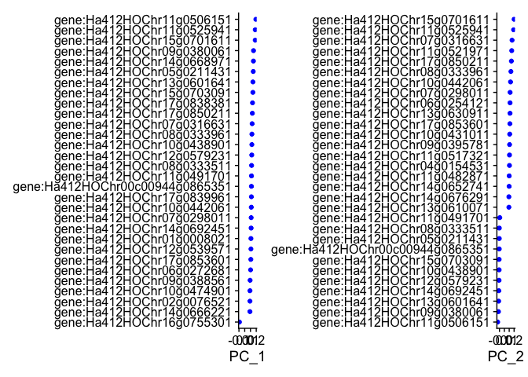<!-- -->

``` r
DimPlot(seurat_object_XRQ_filtered_normalized_selected_scaled_PCA, reduction = "pca") + NoLegend()
```

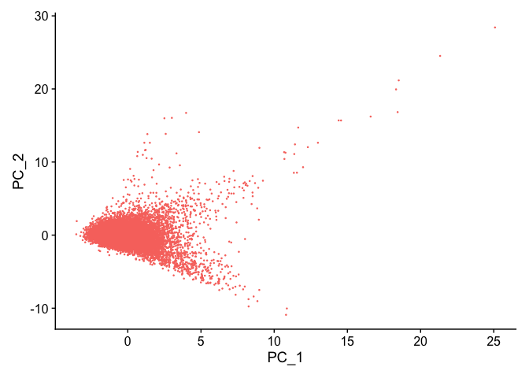<!-- -->

``` r
DimHeatmap(seurat_object_XRQ_filtered_normalized_selected_scaled_PCA, dims = 1:15, cells = 500, balanced = TRUE)
```

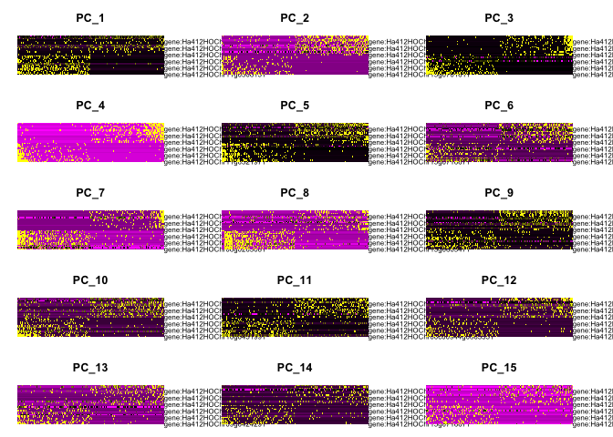<!-- -->

``` r
ElbowPlot(seurat_object_XRQ_filtered_normalized_selected_scaled_PCA)
```

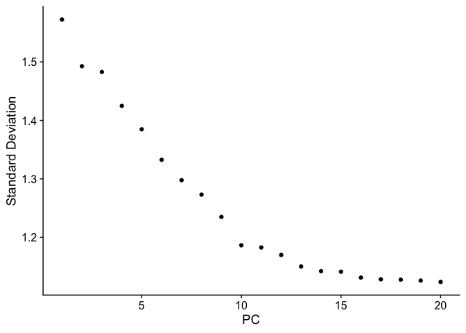<!-- -->

``` r
seurat_object_XRQ_filtered_normalized_selected_scaled_PCA_cellcluster <- FindNeighbors(seurat_object_XRQ_filtered_normalized_selected_scaled_PCA, dims = 1:10)
```

    ## Computing nearest neighbor graph

    ## Computing SNN

``` r
seurat_object_XRQ_filtered_normalized_selected_scaled_PCA_cellcluster <- FindClusters(seurat_object_XRQ_filtered_normalized_selected_scaled_PCA_cellcluster, resolution = 0.5)
```

    ## Modularity Optimizer version 1.3.0 by Ludo Waltman and Nees Jan van Eck
    ## 
    ## Number of nodes: 17001
    ## Number of edges: 423982
    ## 
    ## Running Louvain algorithm...
    ## Maximum modularity in 10 random starts: 0.7543
    ## Number of communities: 10
    ## Elapsed time: 1 seconds

``` r
seurat_object_XRQ_filtered_normalized_selected_scaled_PCA_cellcluster <- RunUMAP(seurat_object_XRQ_filtered_normalized_selected_scaled_PCA_cellcluster, dims = 1:10)
```

    ## 15:27:02 UMAP embedding parameters a = 0.9922 b = 1.112

    ## 15:27:02 Read 17001 rows and found 10 numeric columns

    ## 15:27:02 Using Annoy for neighbor search, n_neighbors = 30

    ## 15:27:02 Building Annoy index with metric = cosine, n_trees = 50

    ## 0%   10   20   30   40   50   60   70   80   90   100%

    ## [----|----|----|----|----|----|----|----|----|----|

    ## **************************************************|
    ## 15:27:03 Writing NN index file to temp file /var/folders/76/gx72vzt52xx0tlcdnpkwb1pw0000gn/T//RtmpoSVJdU/file6b47e29cb64
    ## 15:27:03 Searching Annoy index using 1 thread, search_k = 3000
    ## 15:27:07 Annoy recall = 100%
    ## 15:27:07 Commencing smooth kNN distance calibration using 1 thread with target n_neighbors = 30
    ## 15:27:08 Initializing from normalized Laplacian + noise (using RSpectra)
    ## 15:27:08 Commencing optimization for 200 epochs, with 642432 positive edges
    ## 15:27:08 Using rng type: pcg
    ## 15:27:12 Optimization finished

``` r
DimPlot(seurat_object_XRQ_filtered_normalized_selected_scaled_PCA_cellcluster, reduction = "umap")
```

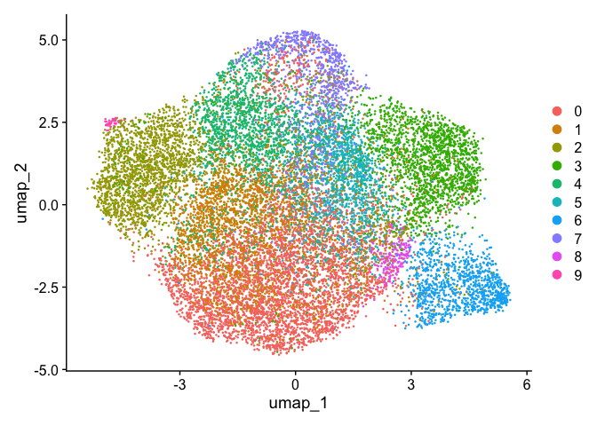<!-- -->

``` r
FeaturePlot(seurat_object_XRQ_filtered_normalized_selected_scaled_PCA_cellcluster, features = c("gene:Ha412HOChr10g0435441", "gene:Ha412HOChr10g0435451", "gene:Ha412HOChr10g0435491", "gene:Ha412HOChr10g0435511"))
```

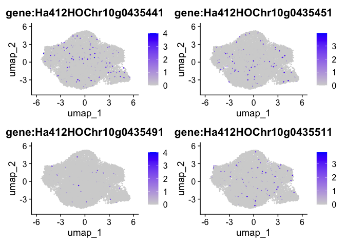<!-- -->

``` r
VlnPlot(seurat_object_XRQ_filtered_normalized_selected_scaled_PCA_cellcluster, features = c("gene:Ha412HOChr10g0435441", "gene:Ha412HOChr10g0435451", "gene:Ha412HOChr10g0435491", "gene:Ha412HOChr10g0435511"))
```

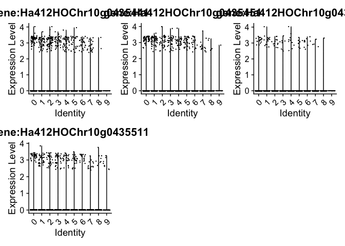<!-- -->

``` r
seurat_XRQ.markers <- FindAllMarkers(seurat_object_XRQ_filtered_normalized_selected_scaled_PCA_cellcluster, only.pos = TRUE)
```

    ## Calculating cluster 0

    ## Calculating cluster 1

    ## Calculating cluster 2

    ## Calculating cluster 3

    ## Calculating cluster 4

    ## Calculating cluster 5

    ## Calculating cluster 6

    ## Calculating cluster 7

    ## Calculating cluster 8

    ## Calculating cluster 9

``` r
seurat_XRQ.markers %>%
  group_by(cluster) %>%
  dplyr::filter(avg_log2FC > 1)
```

    ## # A tibble: 3,479 × 7
    ## # Groups:   cluster [10]
    ##        p_val avg_log2FC pct.1 pct.2 p_val_adj cluster gene                     
    ##        <dbl>      <dbl> <dbl> <dbl>     <dbl> <fct>   <chr>                    
    ##  1 5.06e-  3       1.01 0.01  0.006 1   e+  0 0       gene:Ha412HOChr15g0716501
    ##  2 1.45e-163       2.61 0.152 0.03  4.26e-159 1       gene:Ha412HOChr15g0716671
    ##  3 1.08e-159       2.76 0.166 0.038 3.17e-155 1       gene:Ha412HOChr12g0565541
    ##  4 3.63e-144       3.03 0.107 0.016 1.07e-139 1       gene:Ha412HOChr06g0263501
    ##  5 5.18e-140       2.78 0.116 0.02  1.52e-135 1       gene:Ha412HOChr08g0365321
    ##  6 1.33e-123       2.42 0.131 0.03  3.90e-119 1       gene:Ha412HOChr16g0776481
    ##  7 1.40e-111       3.17 0.078 0.011 4.12e-107 1       gene:Ha412HOChr06g0263531
    ##  8 3.39e-107       2.56 0.106 0.022 9.96e-103 1       gene:Ha412HOChr16g0757601
    ##  9 1.53e- 92       2.79 0.076 0.013 4.51e- 88 1       gene:Ha412HOChr09g0417601
    ## 10 2.06e- 92       1.91 0.147 0.046 6.05e- 88 1       gene:Ha412HOChr02g0082891
    ## # ℹ 3,469 more rows

``` r
seurat_XRQ.markers %>%
  group_by(cluster) %>%
  dplyr::filter(avg_log2FC > 1) %>%
  slice_head(n = 10) %>%
  ungroup() -> top10

DoHeatmap(seurat_object_XRQ_filtered_normalized_selected_scaled_PCA_cellcluster, features = top10$gene)
```

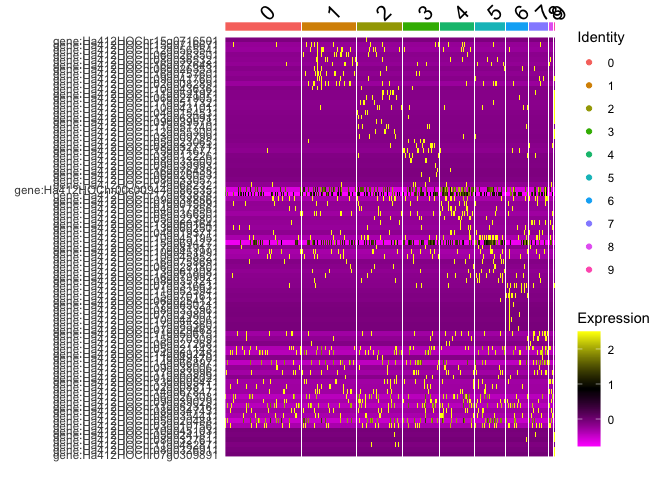<!-- -->
